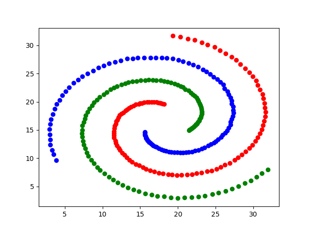
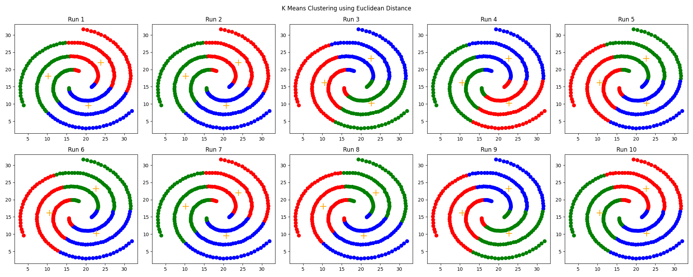
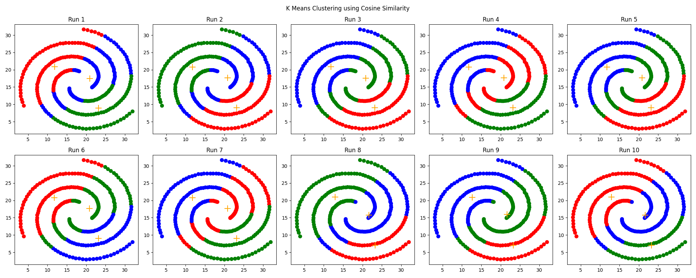
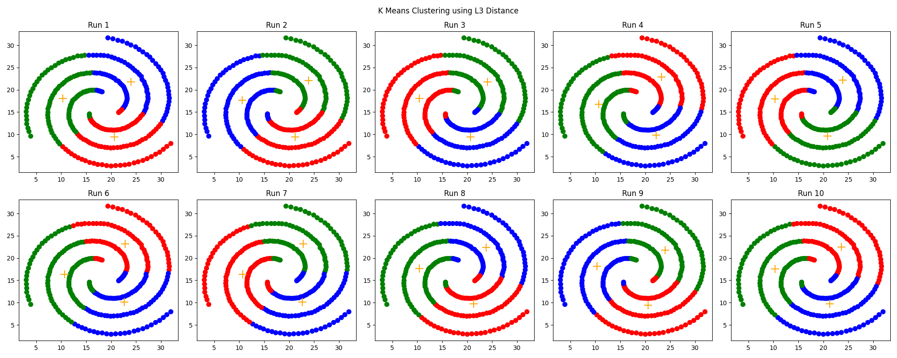

# Assignment 2
### Best Results for SSE and RI over 10 runs using Euclidean Distance, Cosine Similarity, and L3 Distance
| Distance Type       | Best SSE   | Best RI |
| --------------------| ---------- | ------- |
| Euclidean Distance  | 12313.2751 | 0.5544  |
| Cosine Similarity   | 17045.2286 | 0.5624  |
| L3 Distance         | 12299.1322 | 0.5547  |

###
The results show very similar performance for all three distance calculations for Rand Index, with Cosine Similarity performing slightly better than L2 and L3 distance.  
However, Cosine Similarity performs far worse than Euclidean Distance and L3 Distance for Sum of Squared Errors. This may be due the fact the SSE uses euclidean distance when comparing a point to its centroid, so this metrics may have bias towards more typical distance calculations.  
 
<b>Task 1</b>  

  
<b>Euclidean Distance</b>  

  
<b>Cosine Similarity</b>  

  
<b>L3 Distance</b>  
