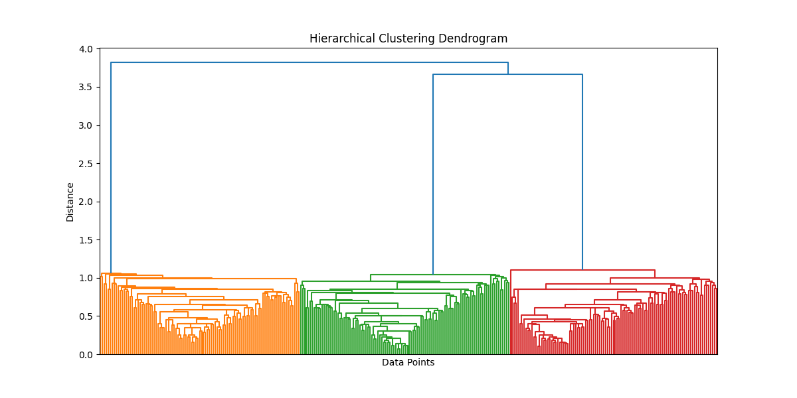
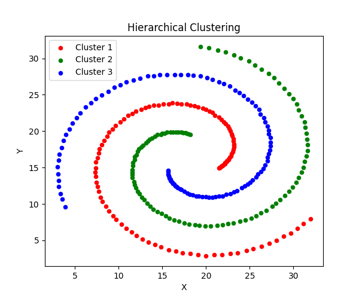
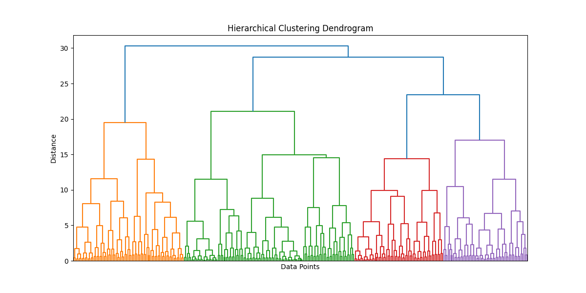
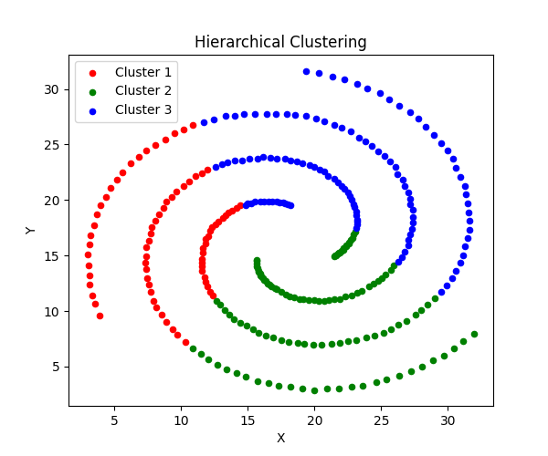
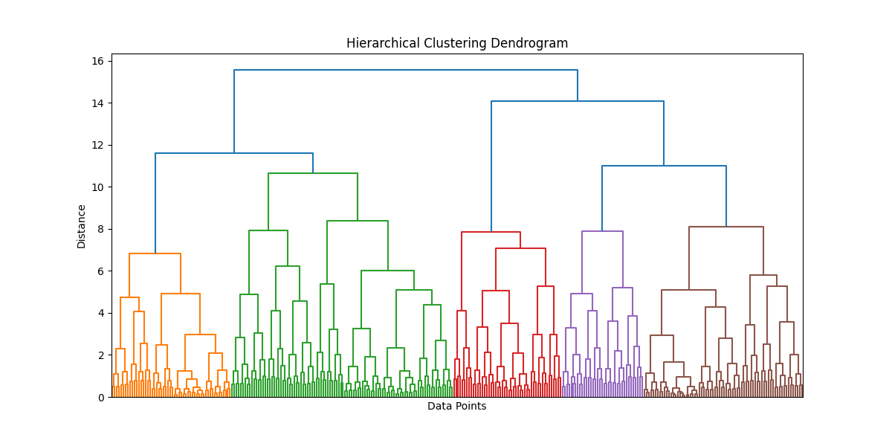
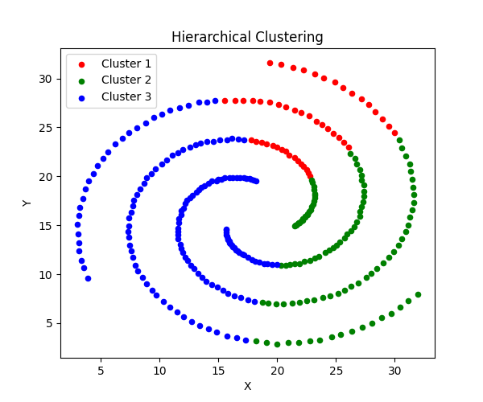
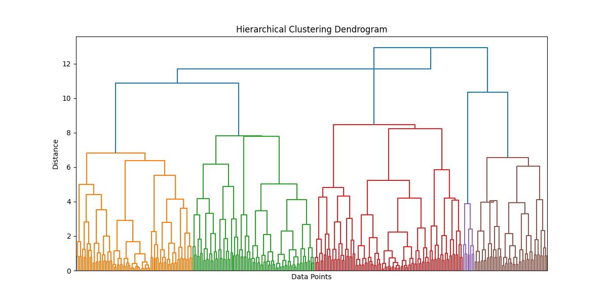
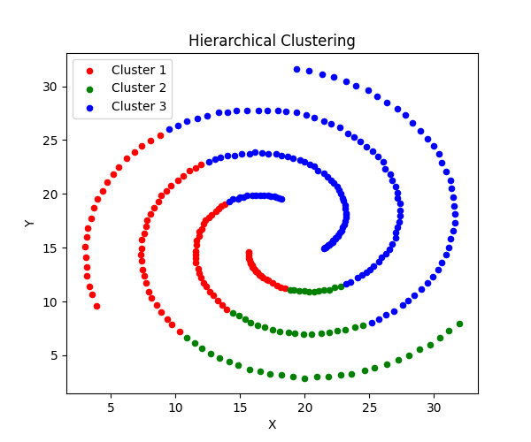

### Single Linkage Clustering
SSE: 30109.3504  
Rand Index: 1.0000  
Cophenetic Correlation Coefficient: -0.0502  
Silhouette Score: 0.0013  
  

  
### Complete Linkage Clustering
SSE: 13004.3742  
Rand Index: 0.5537  
Cophenetic Correlation Coefficient: -0.1495  
Silhouette Score: 0.3455  
  

  
### Average Linkage Clustering
SSE: 14132.1538  
Rand Index: 0.5366  
Cophenetic Correlation Coefficient: -0.3220  
Silhouette Score: 0.3185  
  

  
### Centroid Linkage Clustering
SSE: 14636.1893  
Rand Index: 0.5422  
Cophenetic Correlation Coefficient: -0.0717  
Silhouette Score: 0.3055  
  

  
  

### Analysis of Results
Quick note:  
- The dendrograms for linkage methods (complete, average, centroid) have more than 3 colors, but these do not equate to clusters. The SciPy dendrogram function assigns the colors based on a distance threshold. Looking at the actual plot of the clustering, we can see that there are only 3 clusters.

Best SSE: Complete Linkage  
Best RI: Single Linkage  
Best CCC: Single Linkage  
Best Silhouette Score: Complete Linkage  
  
- Looking at the metrics, complete or single could be the best linkage method. However, for the spiral dataset, the only useful metric is the Rand Index, which shows the similarity between our clustering and the ground truth. The other metrics are misleading due to the spiral nature of the clusters.   
- Single Linkage had a perfect score on Rand Index (1), which means that our algorithm assigned every point to the correct cluster. This can also be seen by viewing the plot of the spiral.  
- While the other linkage methods may have performed better on certain metrics. By looking at the plots we can see that clustering is not accurate.
  
